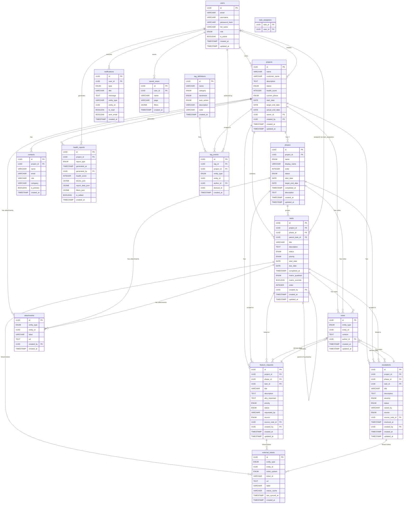

```mermaid
erDiagram
    users {
        UUID id PK
        VARCHAR email
        VARCHAR username
        VARCHAR password_hash
        VARCHAR full_name
        ENUM role
        BOOLEAN is_active
        TIMESTAMP created_at
        TIMESTAMP updated_at
    }

    projects {
        UUID id PK
        VARCHAR name
        VARCHAR customer_name
        TEXT description
        ENUM status
        INTEGER health_score
        ENUM current_phase
        DATE start_date
        DATE target_end_date
        DATE actual_end_date
        UUID owner_id FK
        UUID created_by FK
        TIMESTAMP created_at
        TIMESTAMP updated_at
    }

    phases {
        UUID id PK
        UUID project_id FK
        ENUM name
        VARCHAR display_name
        INTEGER order
        ENUM status
        DATE start_date
        DATE target_end_date
        TIMESTAMP completed_at
        TEXT description
        TIMESTAMP created_at
        TIMESTAMP updated_at
    }

    tasks {
        UUID id PK
        UUID project_id FK
        UUID phase_id FK
        UUID parent_task_id FK
        VARCHAR title
        TEXT description
        ENUM status
        ENUM priority
        DATE start_date
        DATE due_date
        TIMESTAMP completed_at
        ENUM matrix_quadrant
        BOOLEAN matrix_override
        INTEGER order
        UUID created_by FK
        TIMESTAMP created_at
        TIMESTAMP updated_at
    }

    task_assignees {
        UUID task_id FK
        UUID user_id FK
    }

    notes {
        UUID id PK
        ENUM entity_type
        UUID entity_id
        TEXT content
        UUID author_id FK
        TIMESTAMP created_at
        TIMESTAMP updated_at
    }

    attachments {
        UUID id PK
        ENUM entity_type
        UUID entity_id
        VARCHAR label
        TEXT url
        UUID created_by FK
        TIMESTAMP created_at
    }

    external_tickets {
        UUID id PK
        ENUM entity_type
        UUID entity_id
        ENUM ticket_system
        VARCHAR ticket_id
        TEXT url
        VARCHAR label
        VARCHAR status_cache
        TIMESTAMP last_synced_at
        TIMESTAMP created_at
    }

    feature_requests {
        UUID id PK
        UUID project_id FK
        UUID phase_id FK
        UUID task_id FK
        VARCHAR title
        TEXT description
        TEXT why_important
        ENUM priority
        ENUM status
        VARCHAR requested_by
        ENUM source
        UUID source_note_id FK
        UUID created_by FK
        TIMESTAMP created_at
        TIMESTAMP updated_at
    }

    escalations {
        UUID id PK
        UUID project_id FK
        UUID phase_id FK
        UUID task_id FK
        VARCHAR title
        TEXT description
        ENUM severity
        ENUM status
        VARCHAR raised_by
        ENUM source
        UUID source_note_id FK
        TIMESTAMP resolved_at
        UUID created_by FK
        TIMESTAMP created_at
        TIMESTAMP updated_at
    }

    contacts {
        UUID id PK
        UUID project_id FK
        VARCHAR name
        VARCHAR email
        VARCHAR role
        VARCHAR company
        BOOLEAN is_primary
        TIMESTAMP created_at
    }

    health_reports {
        UUID id PK
        UUID project_id FK
        ENUM report_type
        TIMESTAMP generated_at
        UUID generated_by FK
        INTEGER health_score
        JSONB blocks_json
        JSONB report_data_json
        JSONB filters_json
        BOOLEAN is_edited
        TIMESTAMP created_at
    }

    notifications {
        UUID id PK
        UUID user_id FK
        ENUM type
        VARCHAR title
        TEXT message
        VARCHAR entity_type
        UUID entity_id
        BOOLEAN is_read
        BOOLEAN sent_email
        TIMESTAMP created_at
    }

    saved_views {
        UUID id PK
        UUID user_id FK
        VARCHAR name
        VARCHAR page
        JSONB filters
        TIMESTAMP created_at
    }

    tag_definitions {
        UUID id PK
        VARCHAR name
        ENUM category
        ENUM sentiment
        ENUM auto_action
        VARCHAR description
        VARCHAR color
        TIMESTAMP created_at
    }

    tag_events {
        UUID id PK
        UUID tag_id FK
        UUID project_id FK
        ENUM entity_type
        UUID entity_id
        UUID author_id FK
        UUID derived_id
        TIMESTAMP created_at
    }

    %% Core relationships
    users ||--o{ projects : "owns"
    users ||--o{ projects : "creates"
    projects ||--o{ phases : "has 4"
    projects ||--o{ tasks : "contains"
    phases ||--o{ tasks : "groups"
    tasks ||--o{ tasks : "parent of (subtasks)"
    tasks }o--o{ users : "assigned via task_assignees"

    %% Polymorphic note/attachment/ticket targets
    projects ||--o{ notes : "has notes"
    phases ||--o{ notes : "has notes"
    tasks ||--o{ notes : "has notes"
    feature_requests ||--o{ notes : "has notes"
    escalations ||--o{ notes : "has notes"

    projects ||--o{ attachments : "has attachments"
    phases ||--o{ attachments : "has attachments"
    tasks ||--o{ attachments : "has attachments"

    tasks ||--o{ external_tickets : "linked tickets"
    feature_requests ||--o{ external_tickets : "linked tickets"
    escalations ||--o{ external_tickets : "linked tickets"

    %% Related objects
    projects ||--o{ feature_requests : "has"
    phases ||--o{ feature_requests : "scoped to"
    tasks ||--o{ feature_requests : "linked to"
    notes ||--o{ feature_requests : "derives (tag)"

    projects ||--o{ escalations : "has"
    phases ||--o{ escalations : "scoped to"
    tasks ||--o{ escalations : "linked to"
    notes ||--o{ escalations : "derives (tag)"

    projects ||--o{ contacts : "has"

    %% Reporting & user features
    projects ||--o{ health_reports : "generates"
    users ||--o{ health_reports : "generates"
    users ||--o{ notifications : "receives"
    users ||--o{ saved_views : "saves"

    %% Tag system
    tag_definitions ||--o{ tag_events : "fires"
    projects ||--o{ tag_events : "scoped to"
    users ||--o{ tag_events : "authored by"
```
